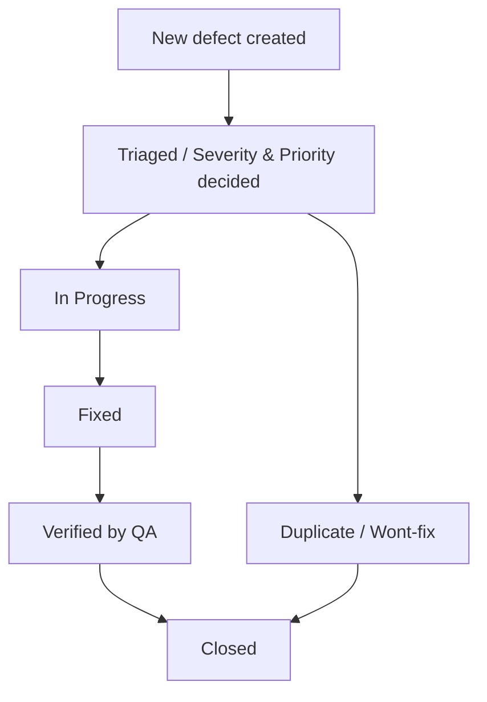

# Defect Lifecycle Diagram

```mermaid
flowchart TD
  A[New defect created] --> B[Triaged / Severity & Priority decided]
  B --> C[In Progress]
  C --> D[Fixed]
  D --> E[Verified by QA]
  E --> F[Closed]
  B --> G[Duplicate / Wont-fix]
  G --> F
```

